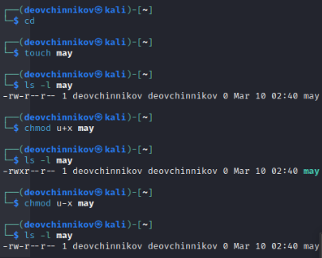
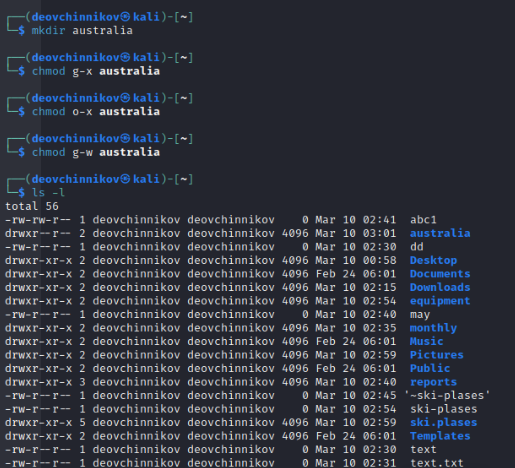

---
## Front matter
lang: ru-RU
title: Анализ файловой системы Linux. Команды для работы с файлами и каталогами
author:
  - Овчинников Данил НБИбд-03-22
institute:
  - Российский университет дружбы народов, Москва, Россия
date: 10 марта 2023

## i18n babel
babel-lang: russian
babel-otherlangs: english

## Formatting pdf
toc: false
toc-title: Содержание
slide_level: 2
aspectratio: 169
section-titles: true
theme: metropolis
header-includes:
 - \metroset{progressbar=frametitle,sectionpage=progressbar,numbering=fraction}
 - '\makeatletter'
 - '\beamer@ignorenonframefalse'
 - '\makeatother'

---

## Цель работы

Ознакомление с файловой системой Linux, её структурой, именами и содержанием
каталогов. Приобретение практических навыков по применению команд для работы
с файлами и каталогами, по управлению процессами (и работами), по проверке исполь-
зования диска и обслуживанию файловой системы.

## Выполнение лабораторной работы

1. Выполняю все примеры, приведённые в первой части описания лабораторной работы.
Копирование файла в текущем каталоге. Скопировать файл ~/abc1 в файл april
и в файл may.
Копирование нескольких файлов в каталог. Скопировать файлы april и may в каталог
monthly.
Копирование файлов в произвольном каталоге. Скопировать файл monthly/may в файл
с именем june.
Копирование каталога monthly в каталог monthly.00.
Копирование каталогов в произвольном каталоге. Скопировать каталог monthly.00
в каталог /tmp

{#fig:001 width=70%}

{#fig:002 width=70%}

{#fig:003 width=70%}

Изменил название файла april на july в домашнем каталоге, переместил файл july в каталог monthly.00, переименовал каталог monthly.00
в monthly.01. Переместил каталог monthly.01 в каталог reports. Переименовал каталог reports/monthly.01 в reports/monthly.

{#fig:004 width=70%}

{#fig:005 width=70%}

Создал файл ~/may с правом выполнения для владельца, затем лишил владельца файла ~/may права на выполнение, создал каталог monthly с запретом на чтение для членов группы и всех
остальных пользователей. Создал файл ~/abc1 с правом записи для членов группы.

{#fig:006 width=70%}

{#fig:007 width=70%}

С помощью команды fsck можно проверили целостность файловой системы.

{#fig:008 width=70%}

2. Выполните следующие действия, зафиксировав в отчёте по лабораторной работе
используемые при этом команды и результаты их выполнения:
2.1 Скопировал файл из /usr/include/ в домашний каталог и назвал его
equipment. 

{#fig:009 width=70%}

2.2 В домашнем каталоге создал директорию ~/ski.plases.

{#fig:010 width=70%}

2.3. Переместите файл equipment в каталог ~/ski.plases.
2.4. Переименуйте файл ~/ski.plases/equipment в ~/ski.plases/equiplist.
2.5. Создайте в домашнем каталоге файл abc1 и скопируйте его в каталог
~/ski.plases, назовите его equiplist2.

{#fig:011 width=70%}

2.6. Создайте каталог с именем equipment в каталоге ~/ski.plases.
2.7. Переместите файлы ~/ski.plases/equiplist и equiplist2 в каталог
~/ski.plases/equipment.
2.8. Создайте и переместите каталог ~/newdir в каталог ~/ski.plases и назовите
его plans.
{#fig:012 width=70%}

3. Определил опции команды chmod, необходимые для того, чтобы присвоить перечис-
ленным ниже файлам выделенные права доступа, считая, что в начале таких прав
нет:
3.1. drwxr--r-- ... australia
3.2. drwx--x--x ... play
3.3. -r-xr--r-- ... my_os
3.4. -rw-rw-r-- ... feathers
При необходимости создал нужные файлы.

{#fig:013 width=70%}

{#fig:014 width=70%}

{#fig:015 width=70%}

{#fig:016 width=70%}

4. Проделайте приведённые ниже упражнения, записывая в отчёт по лабораторной
работе используемые при этом команды:
4.1. Просмотрите содержимое файла /etc/password. У меня его не оказалось.
4.2. Скопируйте файл ~/feathers в файл ~/file.old командой cp.
4.3. Переместите файл ~/file.old в каталог ~/play командой mv.
4.4. Скопируйте каталог ~/play в каталог ~/fun при помощи cp -r.
4.5. Переместите каталог ~/fun в каталог ~/play и назовите его games при помощи mv.
4.6. Лишите владельца файла ~/feathers права на чтение при помощи chmod u-r.
4.7. Что произойдёт, если вы попытаетесь просмотреть файл ~/feathers командой
cat? Видно на скриншоте.
4.8. Что произойдёт, если вы попытаетесь скопировать файл ~/feathers? Видно на скриншоте при помощи cp.
4.9. Дайте владельцу файла ~/feathers право на чтение. Команда chmod u+r.
4.10. Лишите владельца каталога ~/play права на выполнение. Команда chmod u-x.
4.11. Перейдите в каталог ~/play. Что произошло? Перешел при помощи cd.
4.12. Дайте владельцу каталога ~/play право на выполнение. Выдал при помощи chmod u+x.

{#fig:017 width=70%}

5. Прочитал man по командам mount, fsck, mkfs, kill.

{#fig:018 width=70%}

{#fig:019 width=70%}

{#fig:020 width=70%}

## Выводы

Ознакомился с файловой системой Linux, её структурой, именами и содержанием каталогов. Приобрел практические навыки по применению команд для работы с файлами и каталогами, по управлению процессами (и работами), по проверке использования диска и обслуживанию файловой системы.