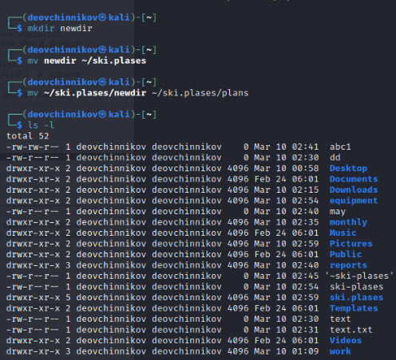

---
## Front matter
title: "Лабораторная работа-05"
subtitle: "Анализ файловой системы Linux. Команды для работы с файлами и каталогами"
author: "Овчинников Данил НБИбд-03-22"

## Generic otions
lang: ru-RU
toc-title: "Содержание"

## Bibliography
bibliography: bib/cite.bib
csl: pandoc/csl/gost-r-7-0-5-2008-numeric.csl

## Pdf output format
toc: true # Table of contents
toc-depth: 2
lof: true # List of figures
lot: true # List of tables
fontsize: 12pt
linestretch: 1.5
papersize: a4
documentclass: scrreprt
## I18n polyglossia
polyglossia-lang:
  name: russian
  options:
	- spelling=modern
	- babelshorthands=true
polyglossia-otherlangs:
  name: english
## I18n babel
babel-lang: russian
babel-otherlangs: english
## Fonts
mainfont: PT Serif
romanfont: PT Serif
sansfont: PT Sans
monofont: PT Mono
mainfontoptions: Ligatures=TeX
romanfontoptions: Ligatures=TeX
sansfontoptions: Ligatures=TeX,Scale=MatchLowercase
monofontoptions: Scale=MatchLowercase,Scale=0.9
## Biblatex
biblatex: true
biblio-style: "gost-numeric"
biblatexoptions:
  - parentracker=true
  - backend=biber
  - hyperref=auto
  - language=auto
  - autolang=other*
  - citestyle=gost-numeric
## Pandoc-crossref LaTeX customization
figureTitle: "Рис."
tableTitle: "Таблица"
listingTitle: "Листинг"
lofTitle: "Список иллюстраций"
lotTitle: "Список таблиц"
lolTitle: "Листинги"
## Misc options
indent: true
header-includes:
  - \usepackage{indentfirst}
  - \usepackage{float} # keep figures where there are in the text
  - \floatplacement{figure}{H} # keep figures where there are in the text
---

# Цель работы

Ознакомление с файловой системой Linux, её структурой, именами и содержанием
каталогов. Приобретение практических навыков по применению команд для работы
с файлами и каталогами, по управлению процессами (и работами), по проверке исполь-
зования диска и обслуживанию файловой системы.

# Выполнение лабораторной работы

Выполняю все примеры, приведённые в первой части описания лабораторной работы(рис. @fig:001).
Копирование файла в текущем каталоге. Скопировать файл ~/abc1 в файл april
и в файл may.
Копирование нескольких файлов в каталог. Скопировать файлы april и may в каталог
monthly.
Копирование файлов в произвольном каталоге. Скопировать файл monthly/may в файл
с именем june.
Копирование каталога monthly в каталог monthly.00.
Копирование каталогов в произвольном каталоге. Скопировать каталог monthly.00
в каталог /tmp(рис. @fig:001 @fig:002 @fig:003)

{#fig:001 width=70%}

{#fig:002 width=70%}

{#fig:003 width=70%}

Изменил название файла april на july в домашнем каталоге, переместил файл july в каталог monthly.00, переименовал каталог monthly.00
в monthly.01. Переместил каталог monthly.01 в каталог reports. Переименовал каталог reports/monthly.01 в reports/monthly.(рис. @fig:004 @fig:005)

{#fig:004 width=70%}

{#fig:005 width=70%}

Создал файл ~/may с правом выполнения для владельца, затем лишил владельца файла ~/may права на выполнение, создал каталог monthly с запретом на чтение для членов группы и всех
остальных пользователей. Создал файл ~/abc1 с правом записи для членов группы.(рис. @fig:006 @fig:007).

{#fig:006 width=70%}

{#fig:007 width=70%}

С помощью команды fsck можно проверили целостность файловой системы.(рис. @fig:008)

{#fig:008 width=70%}

Выполните следующие действия, зафиксировав в отчёте по лабораторной работе
используемые при этом команды и результаты их выполнения:
Скопировал файл из /usr/include/ в домашний каталог и назвал его
equipment.(рис. @fig:009).

{#fig:009 width=70%}

В домашнем каталоге создал директорию ~/ski.plases.(рис. @fig:010)

{#fig:010 width=70%}

Переместите файл equipment в каталог ~/ski.plases.
Переименуйте файл ~/ski.plases/equipment в ~/ski.plases/equiplist.
Cоздайте в домашнем каталоге файл abc1 и скопируйте его в каталог
~/ski.plases, назовите его equiplist2.(рис. @fig:011)

{#fig:011 width=70%}

Создайте каталог с именем equipment в каталоге ~/ski.plases.
Переместите файлы ~/ski.plases/equiplist и equiplist2 в каталог
~/ski.plases/equipment.
Создайте и переместите каталог ~/newdir в каталог ~/ski.plases и назовите
его plans.(рис. @fig:012)

{#fig:012 width=70%}

Определил опции команды chmod, необходимые для того, чтобы присвоить перечис-
ленным ниже файлам выделенные права доступа, считая, что в начале таких прав
нет:
3.1. drwxr--r-- ... australia
3.2. drwx--x--x ... play
3.3. -r-xr--r-- ... my_os
3.4. -rw-rw-r-- ... feathers
При необходимости создал нужные файлы.(рис. @fig:013 @fig:014 @fig:015 @fig:016)

{#fig:013 width=70%}

{#fig:014 width=70%}

{#fig:015 width=70%}

{#fig:016 width=70%}

Проделайте приведённые ниже упражнения, записывая в отчёт по лабораторной
работе используемые при этом команды:
4.1. Просмотрите содержимое файла /etc/password. У меня его не оказалось.
4.2. Скопируйте файл ~/feathers в файл ~/file.old командой cp.
4.3. Переместите файл ~/file.old в каталог ~/play командой mv.
4.4. Скопируйте каталог ~/play в каталог ~/fun при помощи cp -r.
4.5. Переместите каталог ~/fun в каталог ~/play и назовите его games при помощи mv.
4.6. Лишите владельца файла ~/feathers права на чтение при помощи chmod u-r.
4.7. Что произойдёт, если вы попытаетесь просмотреть файл ~/feathers командой
cat? Видно на скриншоте.
4.8. Что произойдёт, если вы попытаетесь скопировать файл ~/feathers? Видно на скриншоте при помощи cp.
4.9. Дайте владельцу файла ~/feathers право на чтение. Команда chmod u+r.
4.10. Лишите владельца каталога ~/play права на выполнение. Команда chmod u-x.
4.11. Перейдите в каталог ~/play. Что произошло? Перешел при помощи cd.
4.12. Дайте владельцу каталога ~/play право на выполнение. Выдал при помощи chmod u+x.(рис. @fig:017)

{#fig:017 width=70%}

Прочитал man по командам mount, fsck, mkfs, kill.(рис. @fig:018 @fig:019 @fig:020).

{#fig:018 width=70%}

{#fig:019 width=70%}

{#fig:020 width=70%}

# Выводы

Ознакомился с файловой системой Linux, её структурой, именами и содержанием каталогов. Приобрел практические навыки по применению команд для работы с файлами и каталогами, по управлению процессами (и работами), по проверке использования диска и обслуживанию файловой системы.

# Ответы на контрольные вопросы:

1. Характеристика файловой системы, которая использовалась в данной лабораторной работе:
Файлы: abc1, april, may, june, july, isdv4.h, equipment, equiplist, equiplist2, my_os, feathers, file.old.
Каталоги: monthly, monthly.00, tmp, monthly.01, reports, usr, ski.plases, equipment, newdir, plans, australia, play, etc, fun, games.

2. Пример общей структуры файловой системы: /home/pdarzhankina/monthly/april, где /home/pdarzhankina – домашний каталог, /monthly – каталог, находящийся в домашнем и содержащий файл, /аpril – файл, находящийся в каталоге.

3. Чтобы содержимое некоторой файловой системы было доступно операционной системе должно быть выполнено монтирование тома.

4. Основные причины нарушения целостности файловой системы:
- Один блок адресуется несколькими mode (принадлежит нескольким файлам).
- Блок помечен как свободный, но в то же время занят (на него ссылается onode).
- Блок помечен как занятый, но в то же время свободен (ни один inode на него не ссылается).
- Неправильное число ссылок в inode (недостаток или избыток ссылающихся записей в каталогах).
- Несовпадение между размером файла и суммарным размером адресуемых inode блоков.
- Недопустимые адресуемые блоки (например, расположенные за пределами файловой системы).
- "Потерянные" файлы (правильные inode, на которые не ссылаются записи каталогов).
- Недопустимые или неразмещенные номера inode в записях каталогов.
Чтобы устранить повреждения файловой системы используется команда fsck.

5. Команда mkfs создаёт новую файловую систему.

6. Характеристика команд, которые позволяют просмотреть текстовые файлы:
- для просмотра небольших файлов удобно пользоваться командой cat.
- для просмотра больших файлов используйте команду less — она позволяет осуществлять постраничный просмотр файлов.
- для просмотра начала файла можно воспользоваться командой head, по умолчанию она выводит первые 10 строк файла.
- команда tail выводит несколько (по умолчанию 10) последних строк файла.
7. Основные возможности команды cp:
- копирование файла в текущем каталоге.
- копирование нескольких файлов в каталог.
- копирование файлов в произвольном каталоге.
Опция i в команде cp выведет на экран запрос подтверждения о перезаписи файла, если на место целевого файла вы поставите имя уже существующего файла.
Команда cp с опцией r (recursive) позволяет копировать каталоги вместе с входящими в них файлами и каталогами.

8. Характеристика команд перемещения и переименования файлов и каталогов:
- переименование файлов в текущем каталоге.
mv <старое_название_файла> <новое_название_файла> 
- перемещение файлов в другой каталог.
mv <название_файла> <название_каталога> 
Если необходим запрос подтверждения о перезаписи файла, то нужно использовать опцию i.
- переименование каталогов в текущем каталоге.
mv <старое_название_каталога> <новое_название_каталога> 
- перемещение каталога в другой каталог.
mv <старый_каталога> <новый_каталог> 
- переименование каталога, не являющегося текущим.
mv <каталог/старое_название_каталога> < каталог/новое_название_каталога> 

9. Каждый файл или каталог имеет права доступа: чтение (разрешены просмотр и копирование файла, разрешён просмотр списка входящих в каталог файлов), запись (разрешены изменение и переименование файла, разрешены создание и удаление файлов каталога), выполнение (разрешено выполнение файла, разрешён доступ в
каталог и есть возможность сделать его текущим). Они могу быть изменены командой chmod.

# Список литературы{.unnumbered}

::: {#refs}
:::
