---
## Front matter
lang: ru-RU
title: Текстовой редактор emacs
author:
  - Овчинников Данил НБИбд-03-22
institute:
  - Российский университет дружбы народов, Москва, Россия
date: 6 апреля 2023

## i18n babel
babel-lang: russian
babel-otherlangs: english

## Formatting pdf
toc: false
toc-title: Содержание
slide_level: 2
aspectratio: 169
section-titles: true
theme: metropolis
header-includes:
 - \metroset{progressbar=frametitle,sectionpage=progressbar,numbering=fraction}
 - '\makeatletter'
 - '\beamer@ignorenonframefalse'
 - '\makeatother'

---

## Цель работы

Познакомиться с операционной системой Linux. Получить практические навыки работы с редактором Emacs.

## Выполнение лабораторной работы

Открываю emacs при помощи команды, создаю файл с помощью комбинаций клавиш c-s c-f.

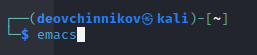{#fig:001 width=70%}

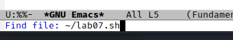{#fig:002 width=70%}

Набираю текст из задания и сохраняю его при помощи сочетаний клавиш c-x c-s

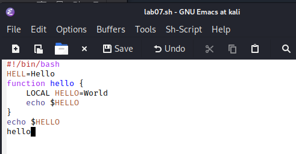{#fig:003 width=70%}

Выполняю стандартные процедуры редактирования, каждое действие осуществляю комбинациями клавиш.(выделяю, копирую, отменяю действия). Использую команды для перемещения курсора. 

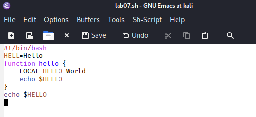{#fig:004 width=70%}

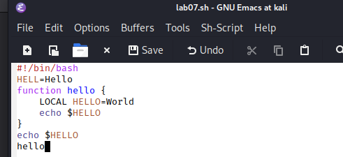{#fig:005 width=70%}

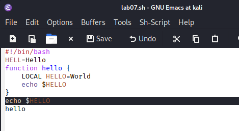{#fig:006 width=70%}

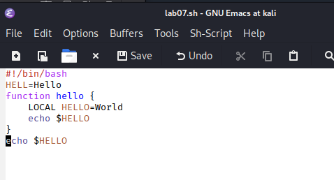{#fig:007 width=70%}

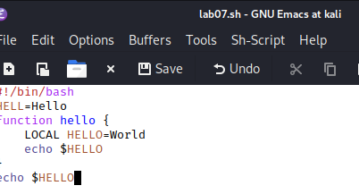{#fig:008 width=70%}

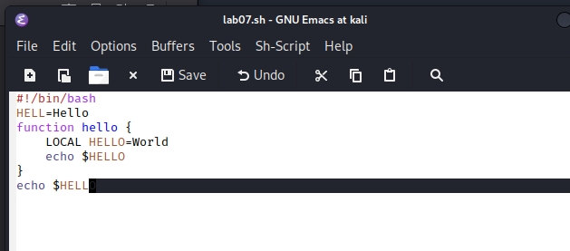{#fig:009 width=70%}

Работаю с буферами, открываю и закрываю, вывожу активные. Переключаюсь между ними

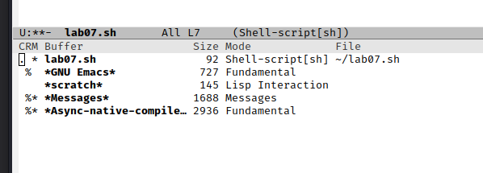{#fig:010 width=70%}

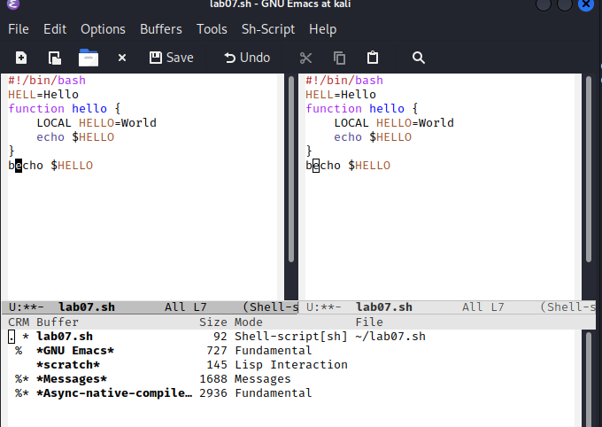{#fig:011 width=70%}

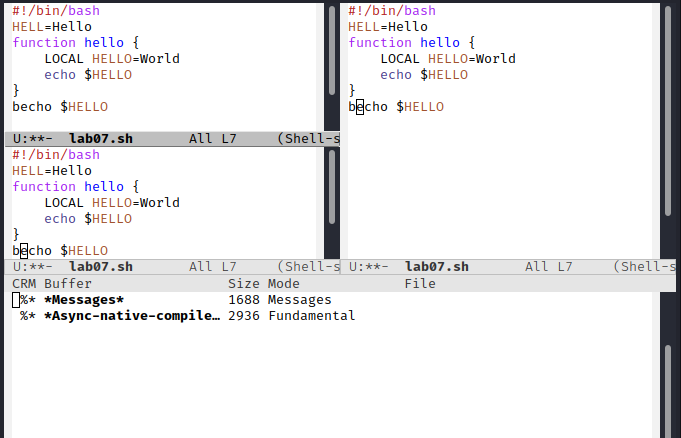{#fig:012 width=70%}

Осущесвляю поиск по словам между окнами, переключаюсь между результатами

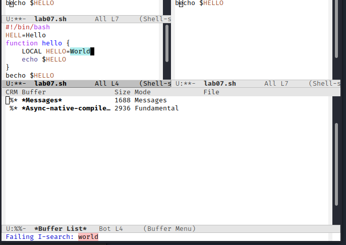{#fig:013 width=70%}

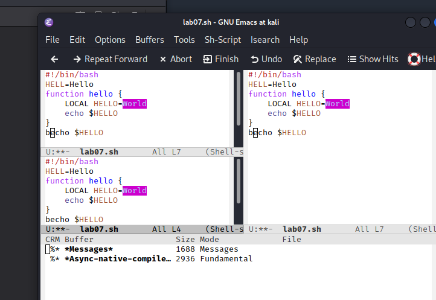{#fig:014 width=70%}

## Выводы

Я познакомился с операционной системой Linux. Получил практические навыки работы с редактором Emacs.
