---
## Front matter
title: "Лабораторная работа-09"
subtitle: "Текстовой редактор emacs"
author: "Овчинников Данил НБИбд-03-22"

## Generic otions
lang: ru-RU
toc-title: "Содержание"

## Bibliography
bibliography: bib/cite.bib
csl: pandoc/csl/gost-r-7-0-5-2008-numeric.csl

## Pdf output format
toc: true # Table of contents
toc-depth: 2
lof: true # List of figures
lot: true # List of tables
fontsize: 12pt
linestretch: 1.5
papersize: a4
documentclass: scrreprt
## I18n polyglossia
polyglossia-lang:
  name: russian
  options:
	- spelling=modern
	- babelshorthands=true
polyglossia-otherlangs:
  name: english
## I18n babel
babel-lang: russian
babel-otherlangs: english
## Fonts
mainfont: PT Serif
romanfont: PT Serif
sansfont: PT Sans
monofont: PT Mono
mainfontoptions: Ligatures=TeX
romanfontoptions: Ligatures=TeX
sansfontoptions: Ligatures=TeX,Scale=MatchLowercase
monofontoptions: Scale=MatchLowercase,Scale=0.9
## Biblatex
biblatex: true
biblio-style: "gost-numeric"
biblatexoptions:
  - parentracker=true
  - backend=biber
  - hyperref=auto
  - language=auto
  - autolang=other*
  - citestyle=gost-numeric
## Pandoc-crossref LaTeX customization
figureTitle: "Рис."
tableTitle: "Таблица"
listingTitle: "Листинг"
lofTitle: "Список иллюстраций"
lotTitle: "Список таблиц"
lolTitle: "Листинги"
## Misc options
indent: true
header-includes:
  - \usepackage{indentfirst}
  - \usepackage{float} # keep figures where there are in the text
  - \floatplacement{figure}{H} # keep figures where there are in the text
---

# Цель работы

Познакомиться с операционной системой Linux. Получить практические навыки работы с редактором Emacs.

# Выполнение лабораторной работы

Открываю emacs при помощи команды, создаю файл с помощью комбинаций клавиш c-s c-f.(рис. @fig:001 @fig:002)

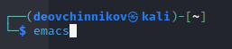{#fig:001 width=70%}

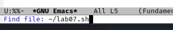{#fig:002 width=70%}

Набираю текст из задания и сохраняю его при помощи сочетаний клавиш c-x c-s(рис. @fig:003).

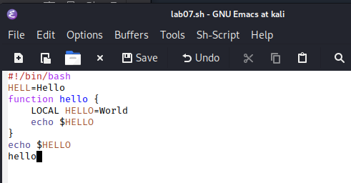{#fig:003 width=70%}

Выполняю стандартные процедуры редактирования, каждое действие осуществляю комбинациями клавиш.(выделяю, копирую, отменяю действия). Использую команды для перемещения курсора. (рис. @fig:004 @fig:005 @fig:006 @fig:007 @fig:008 @fig:009).

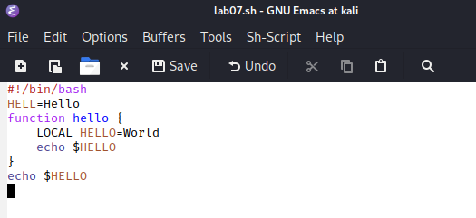{#fig:004 width=70%}

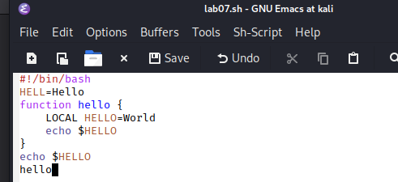{#fig:005 width=70%}

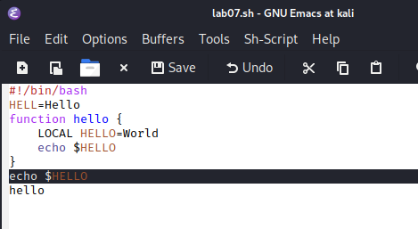{#fig:006 width=70%}

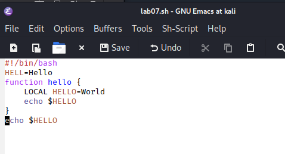{#fig:007 width=70%}

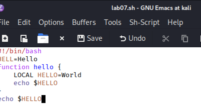{#fig:008 width=70%}

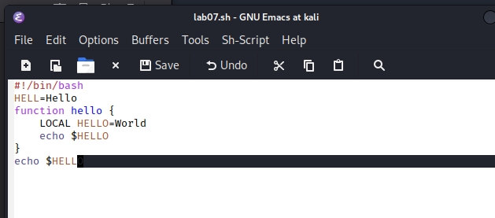{#fig:009 width=70%}

Работаю с буферами, открываю и закрываю, вывожу активные. Переключаюсь между ними(рис. @fig:010 @fig:011 @fig:012)

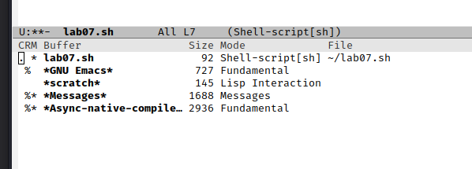{#fig:010 width=70%}

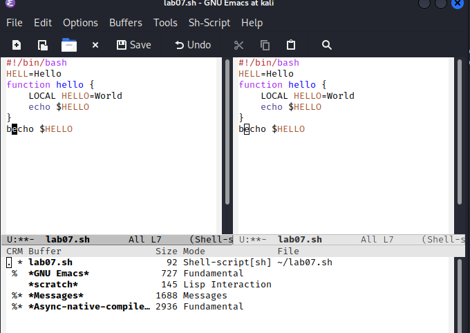{#fig:011 width=70%}

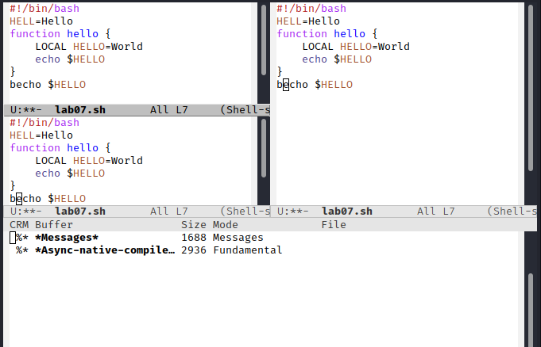{#fig:012 width=70%}

Осущесвляю поиск по словам между окнами, переключаюсь между результатами(рис. @fig:014 @fig:013)

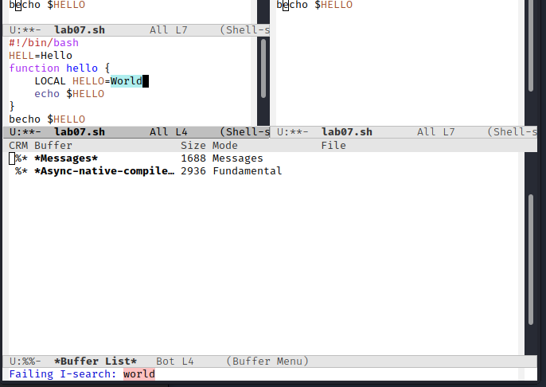{#fig:013 width=70%}

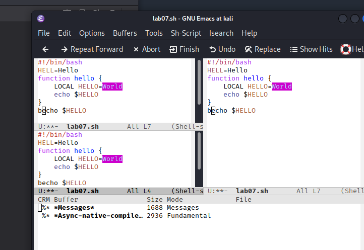{#fig:014 width=70%}

# Выводы

Я познакомился с операционной системой Linux. Получил практические навыки работы с редактором Emacs.

# Ответы на контрольные вопросы:

1. Emacs представляет собой мощный экранный редактор текста, написанный на языке высокого уровня
Elisp.
2. Сложным освоение данной программы для новичка может сделать незнание комбинации клавиш или английского.
3. Моими словами буфер это динамическая память, а окно- то, что мы видим на экране.
4. Можно если нет ограничений на систему.
5. Буферы, которые открываются по умолчанию: GNU Emacs, scratch, Messages, Quail Completions
6. Сtrl+c, Shift+ и Ctrl+c Ctrl+
7. Нажать C-x 3, или C-x 2.
8. Настройки хранятся в файле ~/.emacs.
9. Перемещение курсора
10. Редактор emacs, потому что на нем можно работать сразу с несколькими файлами.

# Список литературы{.unnumbered}

::: {#refs}
:::
