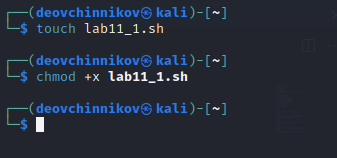
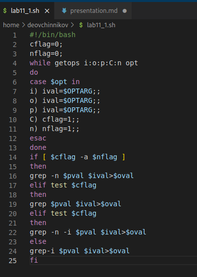
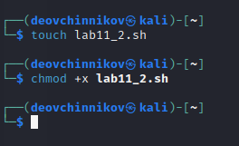
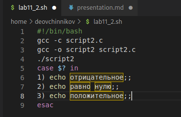
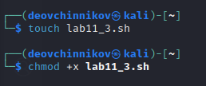
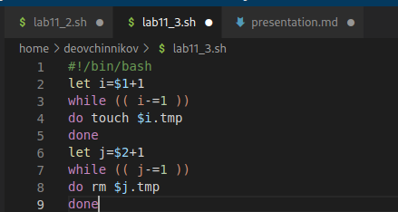
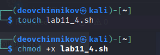
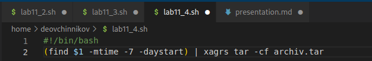

---
## Front matter
title: "Лабораторная работа-11"
subtitle: "Программирование в командном процессоре ОС UNIX. Ветвления и циклы"
author: "Овчинников Данил НБИбд-03-22"

## Generic otions
lang: ru-RU
toc-title: "Содержание"

## Bibliography
bibliography: bib/cite.bib
csl: pandoc/csl/gost-r-7-0-5-2008-numeric.csl

## Pdf output format
toc: true # Table of contents
toc-depth: 2
lof: true # List of figures
lot: true # List of tables
fontsize: 12pt
linestretch: 1.5
papersize: a4
documentclass: scrreprt
## I18n polyglossia
polyglossia-lang:
  name: russian
  options:
	- spelling=modern
	- babelshorthands=true
polyglossia-otherlangs:
  name: english
## I18n babel
babel-lang: russian
babel-otherlangs: english
## Fonts
mainfont: PT Serif
romanfont: PT Serif
sansfont: PT Sans
monofont: PT Mono
mainfontoptions: Ligatures=TeX
romanfontoptions: Ligatures=TeX
sansfontoptions: Ligatures=TeX,Scale=MatchLowercase
monofontoptions: Scale=MatchLowercase,Scale=0.9
## Biblatex
biblatex: true
biblio-style: "gost-numeric"
biblatexoptions:
  - parentracker=true
  - backend=biber
  - hyperref=auto
  - language=auto
  - autolang=other*
  - citestyle=gost-numeric
## Pandoc-crossref LaTeX customization
figureTitle: "Рис."
tableTitle: "Таблица"
listingTitle: "Листинг"
lofTitle: "Список иллюстраций"
lotTitle: "Список таблиц"
lolTitle: "Листинги"
## Misc options
indent: true
header-includes:
  - \usepackage{indentfirst}
  - \usepackage{float} # keep figures where there are in the text
  - \floatplacement{figure}{H} # keep figures where there are in the text
---

# Цель работы

Изучить основы программирования в оболочке ОС UNIX. Научится писать более сложные командные файлы с использованием логических управляющих конструкций и циклов.

# Выполнение лабораторной работы

Используя команды getopts grep, написать командный файл, который анализирует
командную строку с ключами:
– -iinputfile — прочитать данные из указанного файла;
– -ooutputfile — вывести данные в указанный файл;
– -pшаблон — указать шаблон для поиска;
– -C — различать большие и малые буквы;
– -n — выдавать номера строк.
а затем ищет в указанном файле нужные строки, определяемые ключом -p. (рис. @fig:001 @fig:002)

{#fig:001 width=70%}

{#fig:002 width=70%}

Написать на языке Си программу, которая вводит число и определяет, является ли оно
больше нуля, меньше нуля или равно нулю. Затем программа завершается с помощью
функции exit n, передавая информацию в о коде завершения в оболочку. Команд-
ный файл должен вызывать эту программу и, проанализировав с помощью команды, выдать сообщение о том, какое число было введено(рис. @fig:003 @fig:004).

{#fig:003 width=70%}

{#fig:004 width=70%}

Написать командный файл, создающий указанное число файлов, пронумерованных
последовательно от 1 до 𝑁 (например 1.tmp, 2.tmp, 3.tmp,4.tmp и т.д.). Число файлов,
которые необходимо создать, передаётся в аргументы командной строки. Этот же ко-
мандный файл должен уметь удалять все созданные им файлы (если они существуют). (рис. @fig:005 @fig:006).

{#fig:005 width=70%}

{#fig:006 width=70%}

Написать командный файл, который с помощью команды tar запаковывает в архив
все файлы в указанной директории. Модифицировать его так, чтобы запаковывались
только те файлы, которые были изменены менее недели тому назад (использовать
команду find).(рис. @fig:007 @fig:008)

{#fig:007 width=70%}

{#fig:008 width=70%}

# Выводы

Я изучил основы программирования в оболочке ОС UNIX/Linux. Научился писать более
сложные командные файлы с использованием логических управляющих конструкций
и циклов.

# Ответы на контрольные вопросы:

1. Каково предназначение команды getopts? Ответ: Создание по пользовательским аргументам.
2. Какое отношение метасимволы имеют к генерации имён файлов? Ответ:
Используют как файлы так и аргументы.
3. Какие операторы управления действиями вы знаете? Ответ: If, else, elif, fi,
while, do, done, until, do, done, for, in, do, done, case, in, esac
4. Какие операторы используются для прерывания цикла? Ответ:
a) for – будет выполнять действие до тех пор, пока есть объекты для выполнения.
b) while – выполняет действие до тех пор, пока условие является истинным.
c) until – будет выполнятся пока условие не станет правдиво.
5. Для чего нужны команды false и true? Ответ: until – будет выполняться до
тех пор, пока условие не станет true, т.е. пока оно не станет false.
6. Что означает строка if test -f man𝑠/i.$s, встреченная в командном файле?
Ответ: Проверяет если существует файл его размерность и тип c двумя
разными расширениями, заменяя через переменные.
12
7. Объясните различия между конструкциями while и until. Ответ:
while – выполняет действие до тех пор, пока условие является истинным.
until – будет выполняться до тех пор, пока условие не станет истинным, т.е.
пока оно false.

# Список литературы{.unnumbered}

::: {#refs}
:::
